# Fyrypt
UID + PID firewall, `dnscrypt-proxy` manager, and DNS events viewer for Android

**Download:**

 

👉 **Attention:**
- $${\color{red}\textbf{ROOT}}$$ is required. Your device must be rooted. ADB is supported only if [`adb root`](https://android.stackexchange.com/a/213429/218526) works.
- Enabling firewall without proper configuration blocks all network access. You may lock yourself out in case of remote access.

## UID Firewall

Using `owner` [extension](https://www.man7.org/linux/man-pages/man8/iptables-extensions.8.html) of Linux `iptables`, packet filtering can be done based on the UID of the originating process. Android apps have unique UIDs. Define rules. And leave the rest to the kernel.

Fyrypt's UID firewall (main) screen has 2 views:
- **Apps**  
  All apps with the INTERNET permission are listed here. Items can be filtered and sorted by different parameters.

- **Custom UIDs**  
  Here we define UIDs other than those assigned to the apps. Some common UIDs used by Android framework are predefined. For instance, you may like to whitelist AID_NETWORK_STACK (UID 1073), AID_MDNSR (UID 1020) and AID_DNS_TETHER (UID 1052) for Android's network stack to function normally. "Kernel" is a special case. Packets generated by the kernel have no UID.

In both views, there are 2 options (checkboxes) for each UID:
- Whitelist / unblock the UID
- Show notification when the UID is blocked

There's also a configuration screen to manually add firewall rules.

You can learn more about `iptables` from any Linux resources.

## PID Firewall

What if multiple processes are running with the same UID? For instance, a number of processes are running with root (UID 0) on Android devices including the ADB daemon `adbd`. You may want to block all but not the `adbd` so that ADB works. It's not possible with UID-based firewall. It either blocks, or unblocks all.

A solution is PID-based firewall. But it's not available on all devices. Your kernel must be built with `cls_cgroup` and `xt_cgroup` support (config options: NET_CLS_CGROUP, CGROUP_NET_CLASSID and NETFILTER_XT_MATCH_CGROUP). [Here](https://github.com/mirfatif/android-kernel-common) is a sample project. `iptables` binary must also be built with the `cgroup` support. You can download it from [here](https://github.com/mirfatif/android_iptables).

Fyrypt's process firewall screen has 3 views:

- **Processes**  
  Select processes by name. Any processes with the same name and UID are whitelisted as soon as they start (within a few seconds). Very short-lived processes which need connectivity immediately after being started, like `ping`, may not work (see the [difficulties](https://natanyellin.com/posts/tracking-running-processes-on-linux/) of process tracking; unavailability of [proc_events](https://android.googlesource.com/kernel/common/+/refs/tags/android-15.0.0_r0.1/drivers/connector/Kconfig#15) and unusability of [audit](https://android.googlesource.com/platform/system/logging/+/refs/tags/android-15.0.0_r1/logd/libaudit/libaudit.cpp#134) on Android).

- **Services**  
  Select Android's `init` services by name. A service with the same name is whitelisted as soon as it starts (within a fraction of a second).

- **Live Firewall**  
  It's the result of previous 2 configurations. Any running processes which have been whitelisted appear here. If a whitelisted process starts child processes, they are also whitelisted by default. So they also appear here. You can manually block / unblock processes here. These preferences are not remembered.

So, for the example given above, if you want to unblock the `adbd` process (but not other root processes), whitelist the service named `adbd`. Another service `netd` - responsible for DNS queries - also runs with root. You may also unblock it (if not using `dnscrypt-proxy`). But beware that `netd` also proxies connections other than DNS queries. So unblocking it may also unblock other apps.

Similarly, many apps on Android devices are running with the system UID 1000, including the bloatware added by the OEM. If you want to keep them blocked but allow the core Android framework to connect to the internet, you can unblock the `system_server` or `com.android.settings` process.

And so on.

---

Note that a process or an app is unblocked if it's whitelisted by UID, or PID, or both.

There are also **Blocking Groups**. You can add apps, UIDs, processes and services to a group. And then block / unblock the whole group. Long press on an item to add/remove it to/from a group.

## DNSCrypt (dnscrypt-proxy)

Default configuration runs a DoH server on localhost. Customize it if you know what you are doing. Fyrypt app does not pack the `dnscrypt-proxy` binary. You can download it directly from their [repo](https://github.com/DNSCrypt/dnscrypt-proxy/releases/latest).

All local generated and hotspot DNS traffic is redirected to `dnscrypt-proxy`. So no plain DNS queries go to the internet. Bye bye sniffer ISPs.

Configuration screen has 2 more views to manually add allowed and blocked domains. There's also an options on the Settings screen to auto download the blocked list (currently [this](https://raw.githubusercontent.com/StevenBlack/hosts/master/alternates/fakenews-gambling-porn-social/hosts) and [this](https://raw.githubusercontent.com/jerryn70/GoodbyeAds/master/Hosts/GoodbyeAds.txt)). Learn more about the configuration [here](https://github.com/DNSCrypt/dnscrypt-proxy/blob/master/dnscrypt-proxy/example-dnscrypt-proxy.toml).

## Logs

- **Firewall events**  
  Packets blocked due to UID or PID firewall end up here. They don't contain any information related to the process. So they are always attributed to UIDs. You may turn it off to save battery once settled with the configuration.

- **DNSCrypt events**  
  Blocked domains queries appear here, if configured. Learn about `dnscrypt-proxy` configuration (link is given above).

- **DNS events**  
  Apps connecting (or trying to connect) to any domains on the internet are logged here. Sorry developers ☹️

  Optionally encrypted DNS queries (DoH / DoT) can also be logged. But we do not do DPI to find out what the packets contain. Only a guess is made based on their destination. It may give false positives. For instance, https://cloudflare-dns.com hosts both the web service and the DoH service. So if you open the webpage, Fyrypt considers it a DoH query. But such instances are rare.

Repeated entries in the logs appear only once with the repeat count (like `+5`) and the latest timestamp.

Tap on an entry in the logs list to get more information about the IP address / domain.

To be friendly with the flash storage, logs are not stored permanently.

## Limitations of Fyrypt
- Requires root, or `adb root`, as stated above.
- Works on Android 10-15 only.
- You can only whitelist UIDs and PIDs. Blacklist mode is not supported.
- Supports only IPv4, not IPv6.
- Blocking and logging targets only TCP, UDP and ICMP.
- Firewall configuration is limited to OUTPUT only, not INPUT and FORWARD.
- No fine-grained control of LAN, Wi-Fi, Mobile Data, VPN etc.
- No localization, so far.
- More?

## More

**Is Fyrypt open-source?**

No.

**Is Fyrypt completely free of cost?**

No.

**Does Fyrypt collect my data?**

No. Never. Not even a single byte.

**Does Fyrypt show ads?**

No. Ad bombardment exploits psychological and emotional vulnerabilities of humans. Consumerism is evil. It's unfair. We don't do that. But yes. Some real good resources on internet run on ads. We should support them.

**Can Fyrypt block ads?**

Yes. By blocking the plain DNS queries. This doesn't work for the apps which directly use encrypted DNS. But they are not many.

## Why Fyrypt connects to ...?

- `mirfatif.com`: It's home. But Fyrypt doesn't call home when it's with you. Rest assured. Occasional license checks happen with the bare minimum non-personal information sent to our tiny server (details [here](https://mirfatif.github.io/mirfatif/getpro#tnc)). App connects to the same domain when you send a crash report. What's being sent is visible to you on the screen.
- `api.github.com`: To check for app updates.
- `ip-api.com`: When you tap to fetch information about an IP. Note that free queries go over `http`, not `https`.
- `cloudflare-dns.com`: DoH queries for `A` and `PTR` records. Their [JSON API](https://developers.cloudflare.com/1.1.1.1/encryption/dns-over-https/make-api-requests/dns-json).
- `1.1.1.1:80`: Only the TCP handshake to check the internet connectivity. No data transfer occurs.
- Hundreds of name resolutions to get their latest IP addresses when you opt to watch DoH queries. [Here](https://github.com/crypt0rr/public-doh-servers/blob/main/dns.list) is the list. We do not connect to them.
- `raw.githubusercontent.com`: To get the DoH domains list (link is given above). Also to get blacklisted domains when you opt to auto update DNSCrypt blocked list (links are given above).

## Permissions
- QUERY_ALL_PACKAGES: To show apps list.
- POST_NOTIFICATIONS: To show notifications.
- FOREGROUND_SERVICE: To run persistent firewall service.
- ACCESS_NETWORK_STATE: To reapply firewall rules on network changes. Also to check internet connectivity.
- INTERNET: For [on-device ADB access and IPC](https://mirfatif.github.io/PermissionManagerX/help/en/#faq25), license checks, `dnscrypt-proxy` etc. Read detailed functionality above.
- RECEIVE_BOOT_COMPLETED: To start services after reboot.
- WAKE_LOCK: Used by [WorkManager](https://developer.android.com/topic/libraries/architecture/workmanager) for scheduled tasks.

## Screenshots

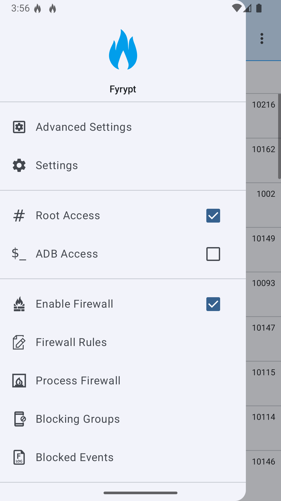 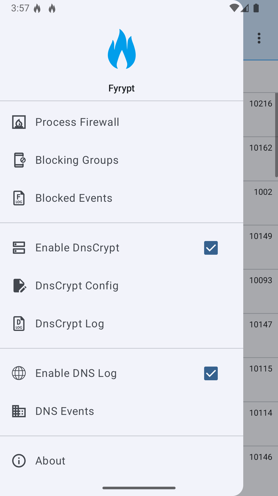 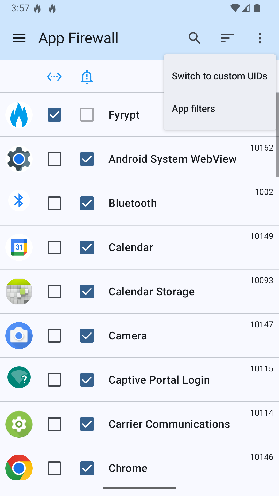 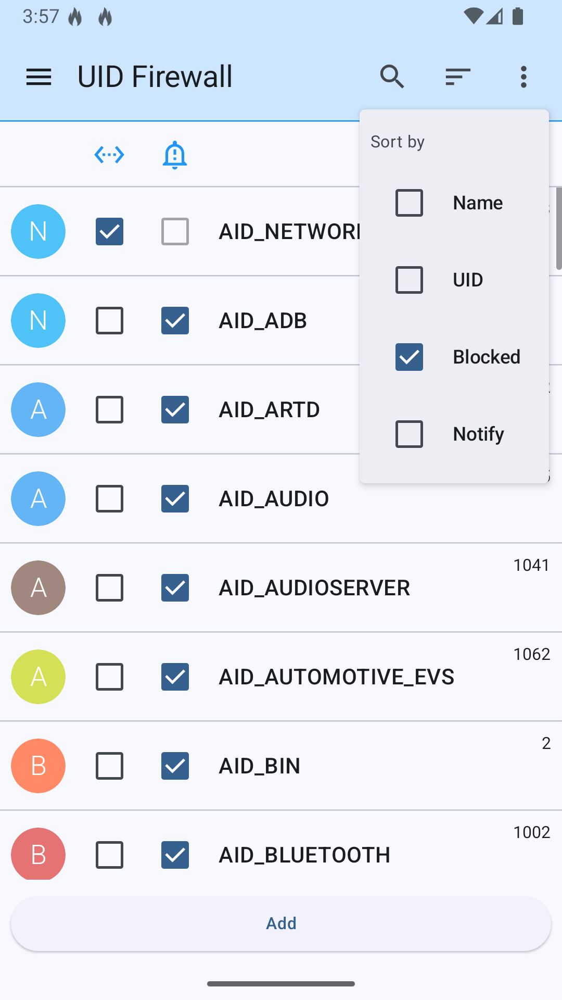 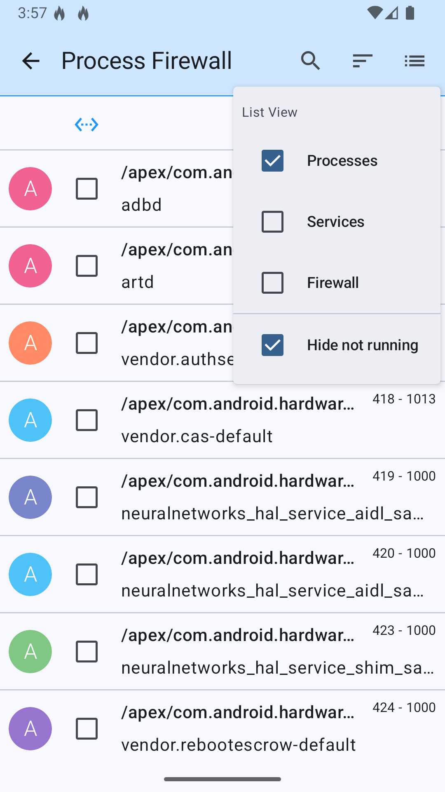 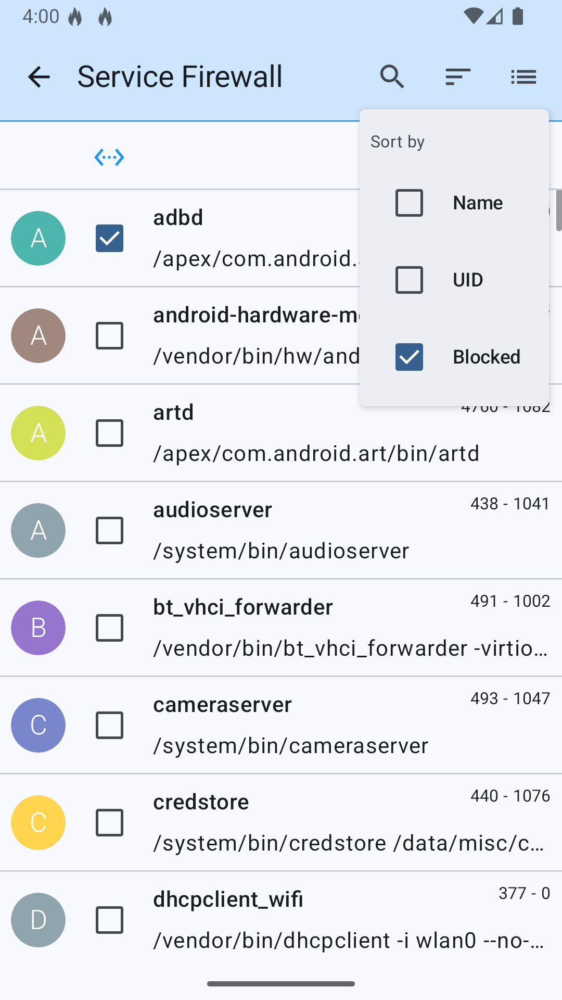 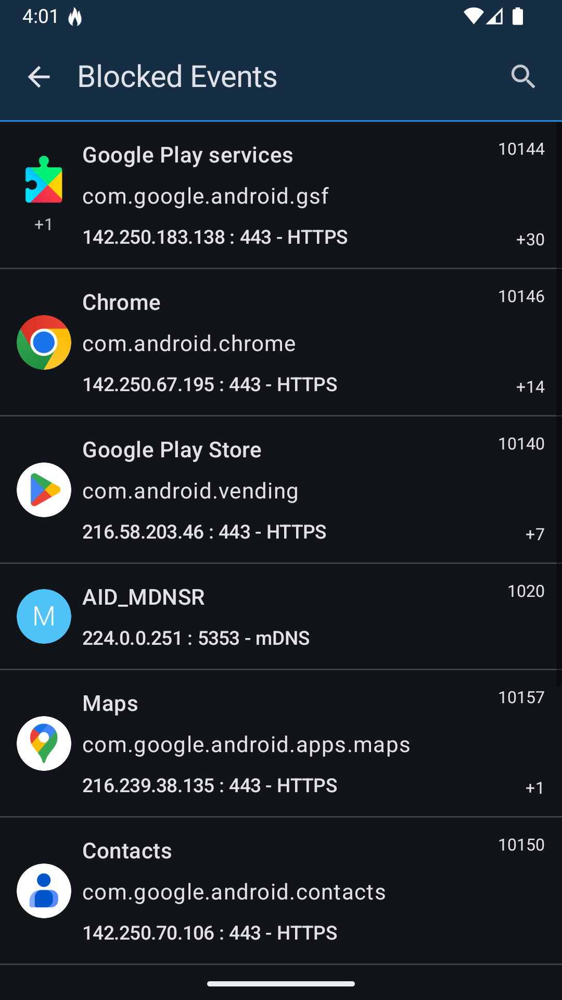 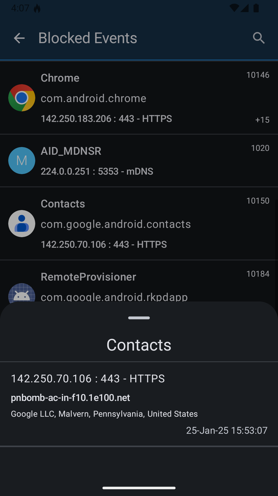 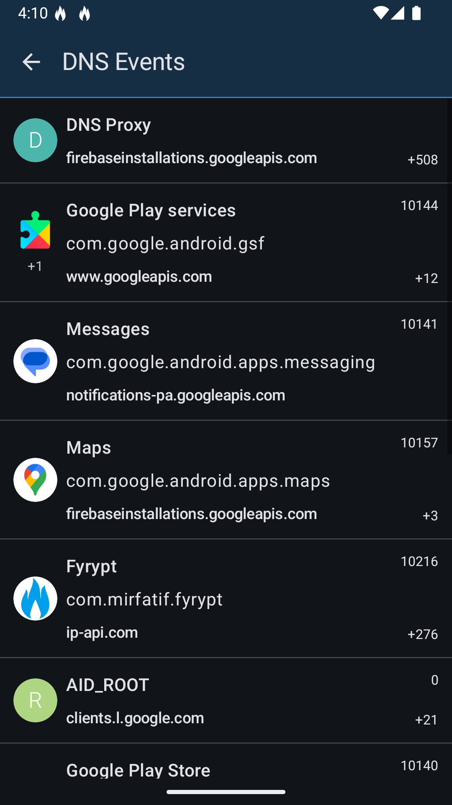 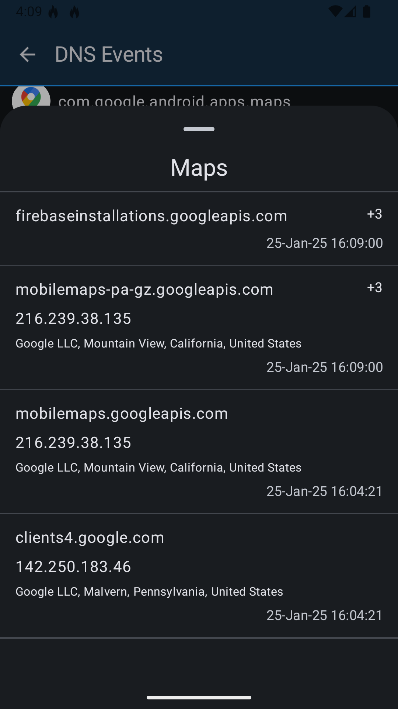 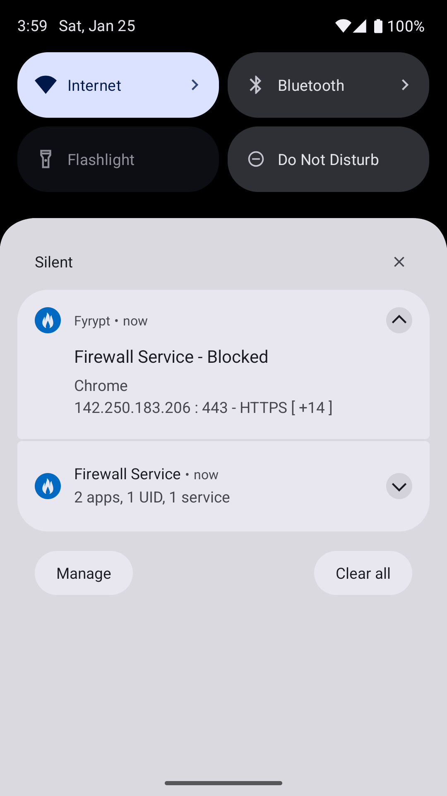 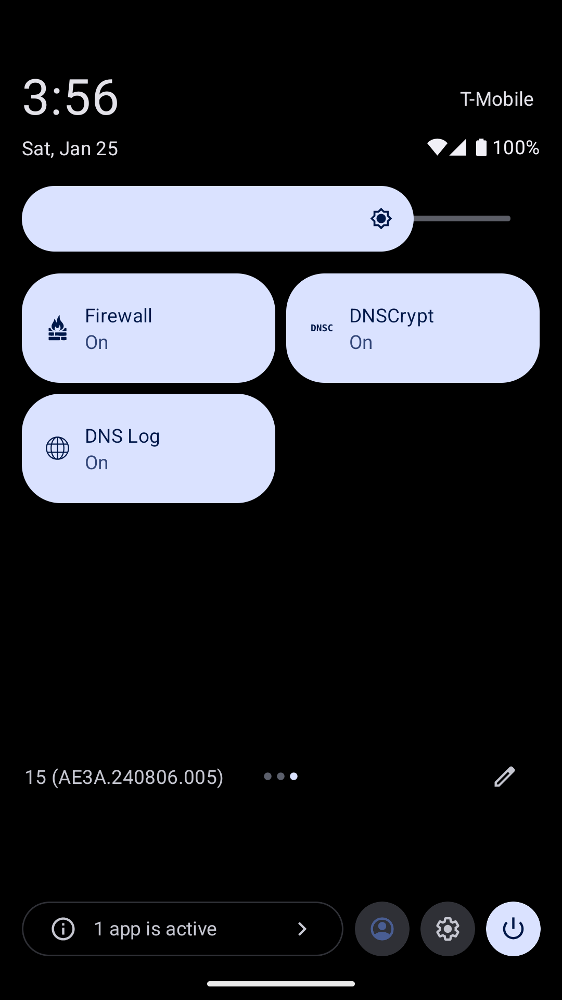

## Libraries
- [Jetpack](https://developer.android.com/jetpack)
- [Moshi](https://github.com/square/moshi)
- [Guava](https://github.com/google/guava)
- [toml4j](https://github.com/mwanji/toml4j)
- [LibADB Android](https://github.com/MuntashirAkon/libadb-android)
- [JElf](https://github.com/fornwall/jelf)
- [LeakCanary](https://github.com/square/leakcanary)

## Contact us
- Having an issue, a bug, a feature proposal? [Issues](https://github.com/mirfatif/Fyrypt/issues)
- Have a question, wanna discuss something? [Discussions](https://github.com/mirfatif/Fyrypt/discussions)
- Email: mirfatif dot dev at gmail dot com
