# Fyrypt
Android firewall with UID + PID rules, `dnscrypt-proxy` management, and per-app live network monitoring

Fyrypt is pronounced as fire-ept (/ˈfaɪɹɛpt/).

**Download:**

 

👉 **Attention:**
- $${\color{red}\textbf{ROOT}}$$ is required. Your device must be rooted. ADB is supported only if [`adb root`](https://android.stackexchange.com/a/213429/218526) works.
- Enabling firewall without proper configuration blocks all network access. You may lock yourself out in case of remote access. Fyrypt itself won't be able to get root access if local network access is denied.

**Contents:**

- [Terminology](#terminology)
- [UID Firewall](#uid-firewall)
  - [Apps view](#apps-view)
  - [UIDs view](#uids-view)
- [PID Firewall](#pid-firewall)
  - [Processes view](#processes-view)
  - [Services view](#services-view)
  - [Live view](#live-view)
- [Firewall management](#firewall-management)
  - [Blocking Groups](#blocking-groups)
  - [New app notify](#new-app-notify)
  - [Visible app unblocking](#visible-app-unblocking)
  - [Block on boot](#block-on-boot)
- [DNSCrypt (dnscrypt-proxy)](#dnscrypt-dnscrypt-proxy)
- [Logs](#logs)
  - [Blocked Events](#blocked-events)
  - [Network Activity](#network-activity)
  - [Blocked Domains](#blocked-domains)
  - [DNS Events](#dns-events)
- [Notable](#notable)
- [Limitations of Fyrypt](#limitations-of-fyrypt)
- [More](#more)
- [Why Fyrypt connects to ...?](#why-fyrypt-connects-to-)
- [Permissions](#permissions)
- [Screenshots](#screenshots)
- [Contact us](#contact-us)

## Terminology

- **PID**: process identifier. Every program or app we run is assigned a unique PID by the core Android operating system (Linux kernel). Processes continuously running in background are called daemons or services.
- **UID**: user identifier. It's a number assigned to processes running on UNIX-like systems (which includes Android). Multiple apps / processes can share a UID. Usually on desktop systems all apps / processes started, and files created by a human user are assigned a unique UID. It adds isolation between users. On Android, however, each app is assigned a unique UID.
- **Firewall**: is a software or hardware which controls the network activity. Linux / Android kernel has a built-in firewall named NetFilter which can be configured using `iptables` tool.
- **Server**: a computer (or a process running on a computer) which provides a specific service to other computers (or processes on the same computer). Websites are a common example. They are hosted on computers called web servers. When we "open" a website, we connect to its web server to fetch the required information or data.
- **IP**: internet protocol. It's the language computers use to talk to each other on internet. Servers on internet have unique numbers assigned called IP addresses. When a client connects to a server, the former uses the IP address of the later to reach it.
- **DNS**: domain name system. Addresses of websites we are familiar with are called domains. They are easy to remember. But networks use IP addresses to identify clients and servers. IP addresses, being numbers, are difficult to remember. So DNS is an active system on internet which maps domains to IP addresses. When we need to access a domain, we first request a DNS server to translate the domain to its IP address. DNS server are accessible at fixed IP addresses.
- [**`dnscrypt-proxy`**](https://github.com/DNSCrypt/dnscrypt-proxy): it's an intermediary DNS server process which we run on our device. It encrypts the DNS queries before sending them to a DNS server on internet. The old plain (unencrypted) DNS queries are easily intercepted by Internet Service Providers (ISP) and governments. Encrypted DNS adds a layer of privacy. In this document we use DNSCrypt (which is also an encryption protocol) to refer to `dnscrypt-proxy`.
- **Private DNS**: Android's encrypted DNS. Then why we need to use `dnscrypt-proxy`? Because Private DNS is not much configurable. For instance, you can't block an unwanted list of domains. Also, Private DNS talks DoT protocol which uses a dedicated port (853), easily identified.

## UID Firewall

Using `owner` [extension](https://www.man7.org/linux/man-pages/man8/iptables-extensions.8.html) of Linux `iptables`, packet filtering can be done based on the UID of the originating process. Android apps have unique UIDs. So define rules. And leave the rest to the kernel.

Fyrypt's UID firewall (main) screen has 3 views:

### Apps view

All apps with the INTERNET permission are listed here. Items can be filtered and sorted by different parameters.

### UIDs view

Here we define UIDs other than those assigned to the apps. Some common UIDs used by Android framework are predefined. For instance, you may like to whitelist AID_NETWORK_STACK (UID 1073), AID_MDNSR (UID 1020) and AID_DNS_TETHER (UID 1052) for Android's network stack to function normally. AID_SHELL (UID 2000, package `com.android.shell`) might also be required for wireless ADB to work. "Kernel" is a special case. Packets generated by the kernel have no UID.

Swipe right a manually added UID to delete it.

### Live view

It's the result of previous 2 configurations. Any running apps or processes which have been unblocked appear here. Note that this list does not include the apps or processes which have been unblocked due to the custom-defined rules.

---

In Apps and UIDs view, there are 2 options (checkboxes) for each UID:
- Whitelist / unblock the app / UID
- Notify when the app / UID is blocked

There's also a configuration screen to manually add firewall rules. Say you want to allow an app to access only certain ports. Define a rule like `-m owner --uid-owner <UID> -m multiport --dports 20:22`. Note that the table, chain and target are not specified. They are injected automatically. In the same way, rules can be defined based on source / destination IP, interface name etc.

You can learn more about `iptables` from any Linux resource.

Note that if multiple apps have same UID, they are blocked / unblocked together.

## PID Firewall

What if multiple processes are running with the same UID? For instance, a number of processes are running with root (UID 0) on Android devices including the ADB daemon `adbd`. You may want to block all but not the `adbd`. It's not possible with UID-based firewall. It either blocks, or unblocks all.

A solution is PID-based firewall. The way it works in Fyrypt, it's not available on all devices. Your kernel must be built with `cls_cgroup` and `xt_cgroup` support (config options: NET_CLS_CGROUP, CGROUP_NET_CLASSID and NETFILTER_XT_MATCH_CGROUP). [Here](https://github.com/mirfatif/android-kernel-common) is a sample project. `iptables` binary must also be built with the `cgroup` support. You can download it from [here](https://github.com/mirfatif/android_iptables).

Fyrypt's process firewall screen has 3 views:

### Processes view

Select processes by name. Any processes with the same name and UID are unblocked as soon as they start (within a few seconds). Very short-lived processes which need connectivity immediately after being started, like `ping`, may not work (see the [difficulties](https://natanyellin.com/posts/tracking-running-processes-on-linux/) and [troubles](https://github.com/evilsocket/opensnitch/wiki/Why-OpenSnitch-does-not-intercept-application-XXX) of process tracking; unavailability of [proc_events](https://android.googlesource.com/kernel/common/+/refs/tags/android-15.0.0_r0.1/drivers/connector/Kconfig#15) and unusability of [audit](https://android.googlesource.com/platform/system/logging/+/refs/tags/android-15.0.0_r1/logd/libaudit/libaudit.cpp#134) on Android).

### Services view

Select Android's `init` services by name. A service with the same name is unblocked as soon as it starts (within a fraction of a second).

### Live view

It's the result of previous 2 configurations. Any running processes which have been unblocked appear here. If a unblocked process starts child processes, they are also unblocked by default. So they also appear here. You can manually block / unblock processes here. These preferences are not remembered.

---

So, for the example given above, if you want to unblock the `adbd` process (but not other root processes), whitelist the service named `adbd`. Another service `netd` - responsible for DNS queries - also runs with root. You may also unblock it (if not using `dnscrypt-proxy`). But beware that `netd` also proxies connections other than DNS queries. So unblocking it may also unblock other apps.

Similarly, many apps on Android devices are running with the system UID 1000, including the bloatware added by the OEM. If you want to keep them blocked but allow the core Android framework to connect to the internet, you can unblock the `system_server` or `com.android.settings` process.

And so on.

## Firewall management

Note that a process or an app is unblocked if it's whitelisted by UID, or PID, or both.

### Blocking Groups

Add apps, UIDs, processes and services to a group. And then block / unblock the whole group. Long press an item to add/remove it to/from a group. Swipe right a group to delete it, or a group member to remove it from the group. Long press a group to rename it.

### New app notify

When firewall service is active and an app is installed which has INTERNET permission, you see a notification to block or unblock the app.

### Visible app unblocking

Firewall service notification shows a button to unblock the foreground app which is visible on screen (provided that it has INTERNET permission and is blocked). If you unblock the app, it remains unblocked as long as you are using it. After being closed, Fyrypt blocks the app after 30 seconds (configurable in Settings).

If the app is part of a group, you see 2 unblock buttons: one for app, other for group.

### Block on boot

From Settings screen you can place a Magisk boot script (in [`/data/adb/post-fs-data.d/`](https://topjohnwu.github.io/Magisk/guides.html#boot-scripts)) which sets `iptables` OUTPUT policy to DROP so that no traffic leaks during startup. When boot completes and Fyrypt starts, it applies firewall rules and resets the policy.

## DNSCrypt (dnscrypt-proxy)

Default configuration runs a DoH server on localhost with cloudflare as upstream server. Customize it if you know what you are doing. Fyrypt app does not pack the `dnscrypt-proxy` binary. You can download it directly from their [repo](https://github.com/DNSCrypt/dnscrypt-proxy/releases/latest).

All local generated and hotspot DNS traffic is redirected to `dnscrypt-proxy`. So no plain DNS queries go to the internet. Bye bye sniffer ISPs.

Configuration screen has 2 more views to manually add allowed and blocked domains. There's also an options on the Settings screen to auto download the blocked list (currently [this](https://raw.githubusercontent.com/StevenBlack/hosts/master/alternates/fakenews-gambling-porn-social/hosts) and [this](https://raw.githubusercontent.com/jerryn70/GoodbyeAds/master/Hosts/GoodbyeAds.txt)). Learn more about the configuration [here](https://github.com/DNSCrypt/dnscrypt-proxy/blob/master/dnscrypt-proxy/example-dnscrypt-proxy.toml).

In order to use `dnscrypt-proxy` as DNS resolver, Android's "Private DNS" feature must be disabled. You'll see a notification if it's enabled.

## Logs

### Blocked Events

Packets blocked due to UID or PID firewall end up here. They don't contain any information related to the process. So they are always attributed to UIDs.

### Network Activity

All outbound connections which have not been blocked are logged here. Monitoring only new connections (started by the apps and other processes) makes better sense. But you may opt in Settings to see all outgoing packets. This also shows outgoing traffic triggered by inbound connections, e.g., traffic from wireless ADB. A lot of local on-device traffic will also show up.

### Blocked Domains

Blocked domains queries appear here, if configured. Learn about `dnscrypt-proxy` configuration (link is given above).

### DNS Events

Apps connecting (or trying to connect) to any domains on the internet are logged here. Sorry developers ☹️

Optionally encrypted DNS queries (DoH / DoT) can also be logged. But we do not do DPI to find out what the packets contain. Only a guess is made based on their destination. It may give false positives. For instance, https://cloudflare-dns.com hosts both the web service and the DoH service. So if you open the webpage, Fyrypt considers it a DoH query. But such instances are rare.

---

If a firewall or DNS event is encountered whose UID is shared by more than one apps, you'll see the count (like `+1`) below the icon. Long press the entry to view all apps (with package names) / UIDs.

Repeated events in the logs appear only once with the repeat count (like `+5`) and the latest timestamp.

Tap an entry in the logs list to view all events. Tap an event to get more information about the IP address. Long press a log event to copy the IP address or domain to clipboard.

If DNS Log is enabled, you may see domain names instead of IPs in the notification and firewall logs.

To be friendly with the flash storage, logs are not stored permanently.

To be friendly with the battery, we try to minimize the CPU load e.g. by rate limiting the processing of identical events. See the live CPU / RAM monitor at the bottom of drawer. Our tests show very minimal impact on the battery life. But you mileage may vary, depending on the network traffic. If not viewing logs, you may want to turn them off, once settled with the configurations.

## Notable

- Fyrypt supports user accounts, **profiles**, and Android 15 private space. But the app itself runs only in the primary user account / owner profile.
- For convenient access from home / launcher, **app shortcuts** are available to different screens.
- Firewall and logs can also be toggled from **quick settings tiles**.
- You can conveniently do **backup / restore** of settings and preferences from Settings screen.
- At the bottom of drawer, there's a live table of **CPU / RAM usage** of different app components for better performance monitoring. [WhatsRunning](https://github.com/mirfatif/WhatsRunning) does it even better.

## Limitations of Fyrypt
- Requires root, or `adb root`, as stated above.
- PID firewall requires a custom kernel (on most devices) as explained above (should we switch to NFQUEUE + eBPF?).
- Works on Android 10-15 only (will try to keep it working on new Android releases).
- You can only whitelist UIDs and PIDs. Blacklist mode is not supported.
- Supports only IPv4, not IPv6 (but planned).
- Blocking and logging targets only TCP, UDP and ICMP.
- Firewall configuration is limited to OUTPUT chain only, not INPUT and FORWARD.
- No fine-grained control of on-device, LAN, Wi-Fi, Mobile Data, VPN etc. (should we add this?)
- No localization, so far (but planned).
- More?

## More

**Is Fyrypt open-source?**

No.

**Is Fyrypt completely free of cost?**

No.

**Does Fyrypt collect my data?**

No. Never. Not even a single byte.

**Does Fyrypt show ads?**

No. Ad bombardment exploits psychological and emotional vulnerabilities of humans. Consumerism is evil. It's unfair. We don't do that. But yes. Some real good resources on internet run on ads. We should support them.

**Can Fyrypt block ads?**

Yes. By blocking the plain DNS queries. This doesn't work for the apps which directly use encrypted DNS. But they are not many.

**Can Fyrypt harm my device?**

Despite having root privileges, Fyrypt does not make any persistent changes to your device. No files are created outside the app directories, no system components are touched. Turn off everything in the drawer (and boot script in the Settings), ungrant root / ADB access, and uninstall the app. Even if something goes unexpected, do a device reboot (e.g. to remove `iptables` rules injected by Fyrypt). And all is clean.

## Why Fyrypt connects to ...?

- `mirfatif.com`: It's home. But Fyrypt doesn't call home when it's with you. Rest assured. Occasional license checks happen with the bare minimum non-personal information sent to our tiny server (details [here](https://mirfatif.github.io/mirfatif/getpro#tnc)). App connects to the same domain when you send a crash report. What's being sent is visible to you on the screen.
- `api.github.com`: To check for app updates.
- `ip-api.com`: When you tap to fetch information about an IP. Note that free queries go over `http`, not `https`.
- `cloudflare-dns.com`: DoH queries for `A` and `PTR` records. Their [JSON API](https://developers.cloudflare.com/1.1.1.1/encryption/dns-over-https/make-api-requests/dns-json). By default `dnscrypt-proxy` is also configured to use Cloudflare as the upstream server.
- `1.1.1.1:80`: Only the TCP handshake to check the internet connectivity. No data transfer occurs.
- Hundreds of name resolutions to get their latest IP addresses when you opt to watch DoH queries. [Here](https://github.com/crypt0rr/public-doh-servers/blob/main/dns.list) is the list. We do not connect to them.
- `raw.githubusercontent.com`: To get the DoH domains list (link is given above). Also to get blacklisted domains when you opt to auto update DNSCrypt blocked list (links are given above).

## Permissions
- QUERY_ALL_PACKAGES: To show apps list.
- POST_NOTIFICATIONS: To show notifications.
- FOREGROUND_SERVICE: To run persistent firewall service.
- ACCESS_NETWORK_STATE: To reapply firewall rules on network changes. Also to check internet connectivity.
- INTERNET: For [on-device ADB access and IPC](https://mirfatif.github.io/PermissionManagerX/help/en/#faq25), license checks, `dnscrypt-proxy` etc. Read detailed functionality above.
- RECEIVE_BOOT_COMPLETED: To start services after reboot.
- WAKE_LOCK: Used by [WorkManager](https://developer.android.com/topic/libraries/architecture/workmanager) for scheduled tasks.

You can use [PMX](https://github.com/mirfatif/PermissionManagerX) to see all requested and granted permissions.

## Screenshots

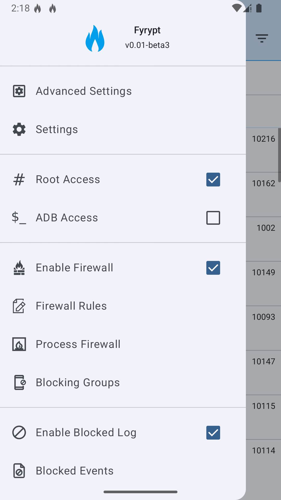 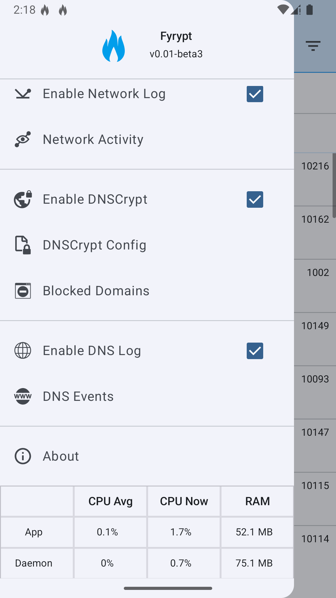 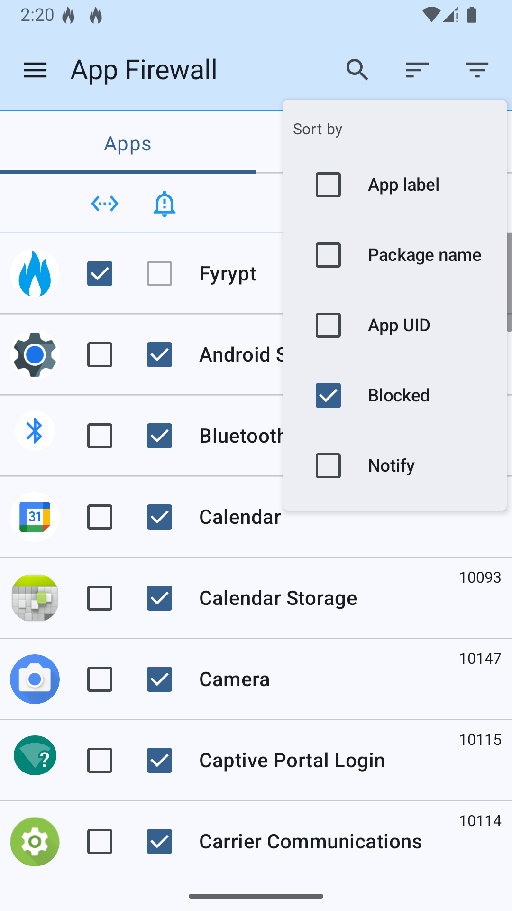 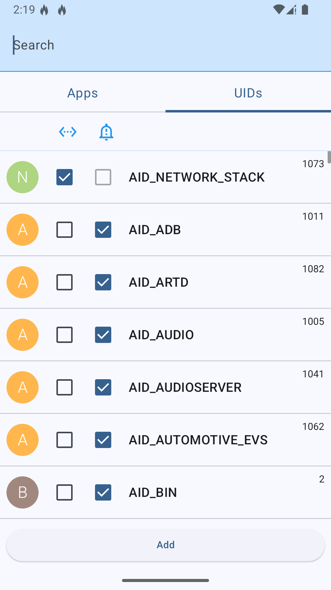 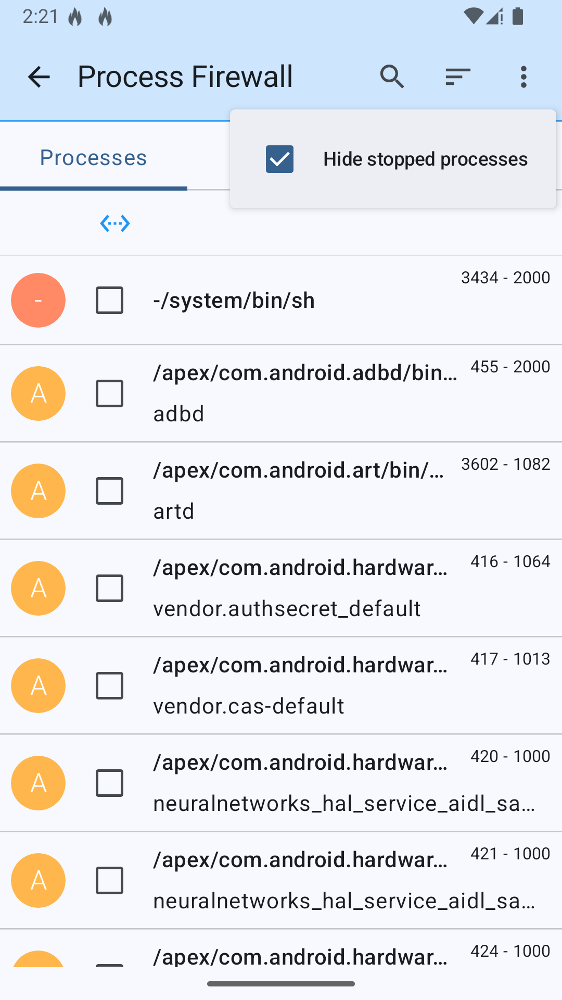 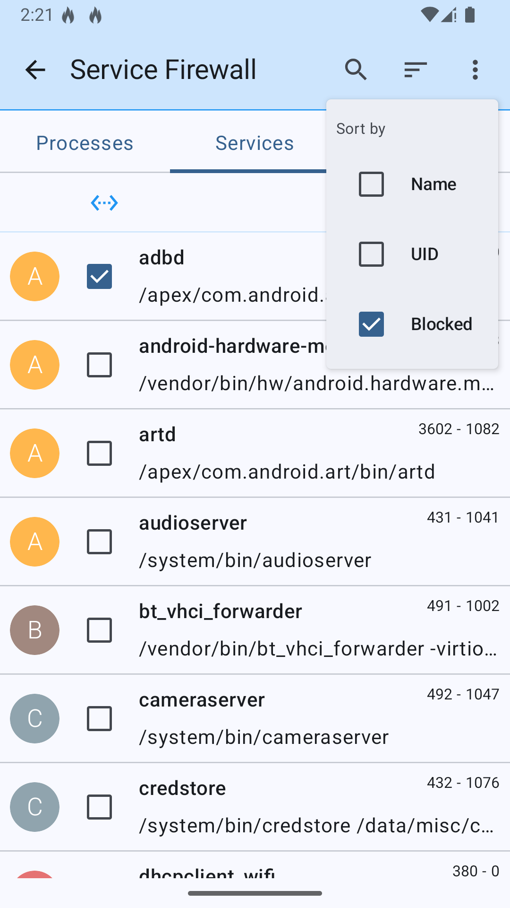 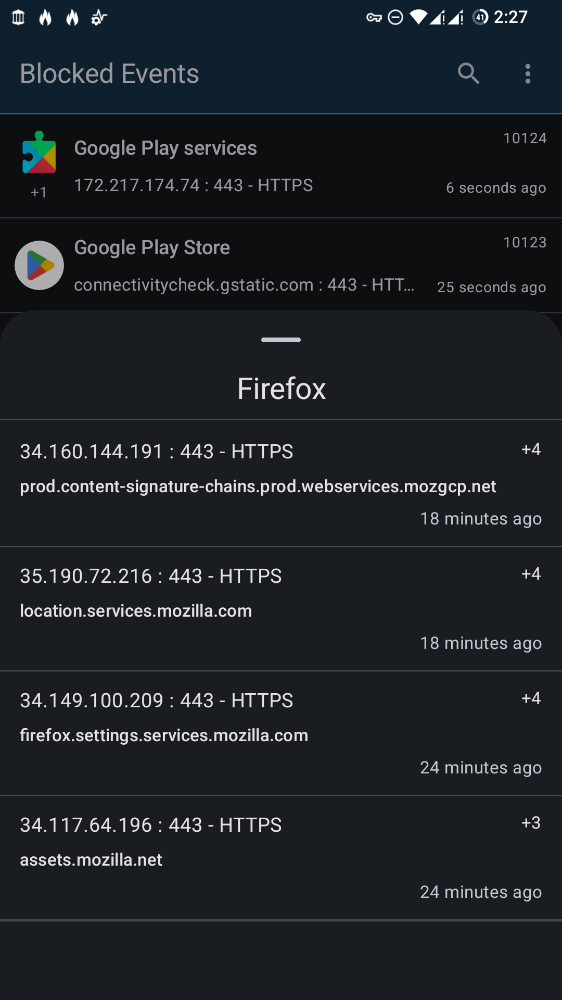  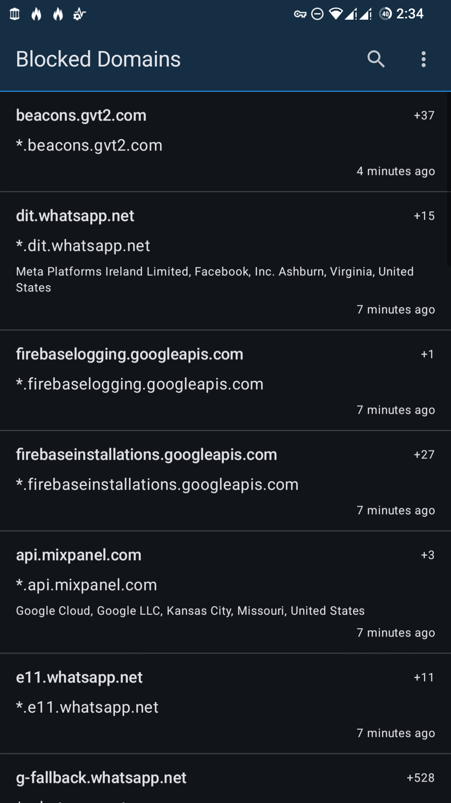 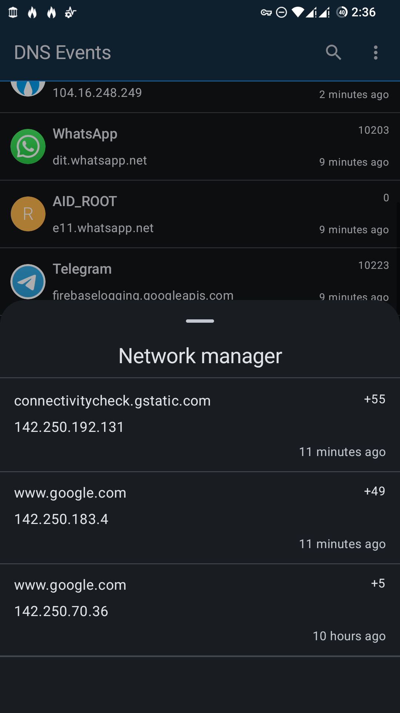 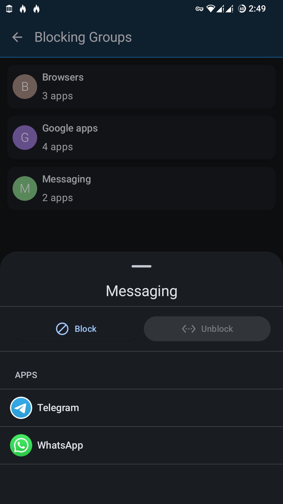 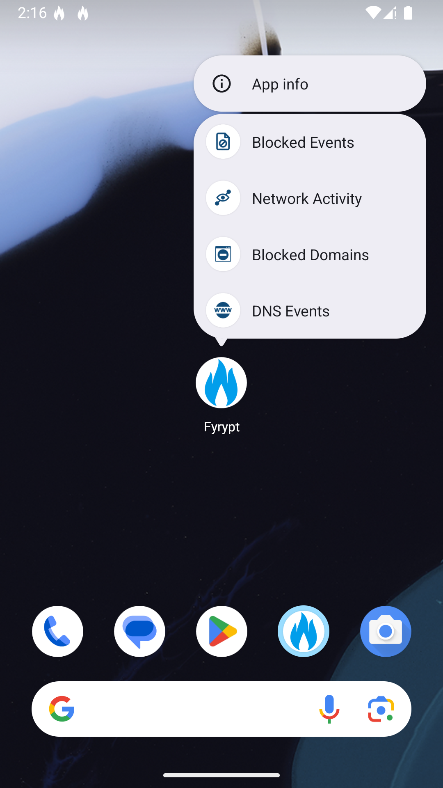  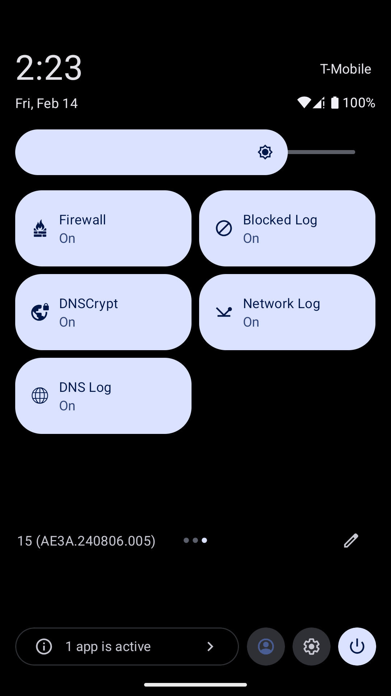  

## Translation

## Used Libraries

- [Jetpack](https://developer.android.com/jetpack)
- [Moshi](https://github.com/square/moshi)
- [Guava](https://github.com/google/guava)
- [toml4j](https://github.com/mwanji/toml4j)
- [LibADB Android](https://github.com/MuntashirAkon/libadb-android)
- [JElf](https://github.com/fornwall/jelf)
- [LeakCanary](https://github.com/square/leakcanary)
- [BeeTablesCompose](https://github.com/Breens-Mbaka/Jetpack-Compose-Tables)
- [SPCDNS](https://github.com/spc476/SPCDNS)
- [netfilter_log](https://netfilter.org/projects/libnetfilter_log)

## Contact us
- Having an issue, a bug, a feature proposal? [Issues](https://github.com/mirfatif/Fyrypt/issues)
- Have a question, wanna discuss something? [Discussions](https://github.com/mirfatif/Fyrypt/discussions)
- Email: mirfatif dot dev at gmail dot com
